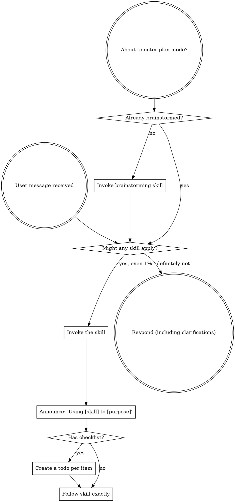

<SUBAGENT-STOP>
If you were dispatched as a subagent to execute a specific task, skip this skill.
</SUBAGENT-STOP>

<EXTREMELY-IMPORTANT>
If you think there is even a 1% chance a skill might apply to what you are doing, you ABSOLUTELY MUST invoke the skill.

IF A SKILL APPLIES TO YOUR TASK, YOU DO NOT HAVE A CHOICE. YOU MUST USE IT.

This is not negotiable. This is not optional. You cannot rationalize your way out of this.
</EXTREMELY-IMPORTANT>

## Instruction Priority

Superpowers skills override default system prompt behavior, but **user instructions always take precedence**:

1. **User's explicit instructions** (CLAUDE.md, GEMINI.md, AGENTS.md, direct requests) — highest priority
2. **Superpowers skills** — override default system behavior where they conflict
3. **Default system prompt** — lowest priority

If CLAUDE.md, GEMINI.md, or AGENTS.md says "don't use TDD" and a skill says "always use TDD," follow the user's instructions. The user is in control.

## How to Access Skills

**Never read skill files manually with file tools** — always use your platform's skill-loading mechanism so the skill is properly activated.

**In Claude Code:** Use the `Skill` tool. When you invoke a skill, its content is loaded and presented to you — follow it directly.

**In Codex:** Skills load natively. Follow the instructions presented when a skill activates.

**In Copilot CLI:** Use the `skill` tool. Skills are auto-discovered from installed plugins.

**In Gemini CLI:** Skills activate via the `activate_skill` tool. Gemini loads skill metadata at session start and activates the full content on demand.

**In other environments:** Check your platform's documentation for how skills are loaded.

## Platform Adaptation

Skills speak in actions ("dispatch a subagent", "create a todo", "read a file") rather than naming any one runtime's tools. For per-platform tool equivalents and instructions-file conventions, see [claude-code-tools.md](references/claude-code-tools.md), [codex-tools.md](references/codex-tools.md), [copilot-tools.md](references/copilot-tools.md), [gemini-tools.md](references/gemini-tools.md), [pi-tools.md](references/pi-tools.md), and [antigravity-tools.md](references/antigravity-tools.md). Gemini CLI users get the tool mapping loaded automatically via GEMINI.md.

# Using Skills

## The Rule

**Invoke relevant or requested skills BEFORE any response or action.** Even a 1% chance a skill might apply means that you should invoke the skill to check. If an invoked skill turns out to be wrong for the situation, you don't need to use it.

## When the User Names a Specific Skill

If the user's prompt references a skill by name (e.g., "use brainstorming," "use context management," "run verification"), that is a **Skill tool invocation request**:

1. Still check for relevant skills — the named skill may not be the only one that applies.
2. **Invoke the named skill via the `Skill` tool.** Do not re-implement the skill's purpose with ad-hoc agents, manual file reads, or improvised workflows. The skill contains tested, structured logic — use it.
3. Skip complexity classification if the user already chose the route.

This is the most common cause of entry sequence bypass: the AI interprets "use X skill" as a goal to achieve creatively rather than as a tool invocation. It is always a tool invocation.

## EnterPlanMode Intercept

If Claude is about to enter plan mode (`EnterPlanMode`), check whether brainstorming has been completed for the current task:

- **No brainstorming done for this task**: invoke `brainstorming` first — plan mode without a validated design leads to plans built on unexamined assumptions.
- **Brainstorming already completed and design approved**: proceed to plan mode / `writing-plans`.

## Complexity Classification

Classify every task into one of three levels before acting.

### Hard overrides — check these first, before anything else

If any of the following are true, classify as **full** immediately — do not evaluate the lightweight criteria:

- The change adds, modifies, or removes a condition, gate, or trigger that determines when behavior fires
- The change affects what the user sees or experiences (excluding cosmetic text changes to existing UI — e.g., updating a label, rewording a message, or changing static copy that doesn't alter flow or behavior)
- The change modifies a file that other components depend on (routing rules, entry sequences, config registries, shared hooks)
- The change introduces a path or outcome that didn't exist before

**When in doubt, classify as full.** An unnecessary brainstorming session costs one extra round. Skipping brainstorming on a task that needed it ships a gap. The asymmetry is not equal — always err toward full.

### Micro (skip everything)
- Typo fix, single variable rename, 1-line config change
- **Action:** Just do it. No skills needed.

### Lightweight (fast path)
All of these must be true:
- Change scope is small (~2 files or fewer)
- No new behavior or architecture change
- No cross-module dependency risk
- No migration or data-shape change

**Before classifying as lightweight:** explicitly state in one sentence why each of the four criteria above is satisfied. Do not assume. If you cannot articulate any one of them clearly, classify as full.

**Action:** Go directly to implementation. Only gate: invoke `verification-before-completion` when done. Skip brainstorming, planning, worktrees, and parallel dispatch.

**Exception:** If a dedicated implementation skill exists for this specific task (check the Routing Guide), invoke it — lightweight skips workflow overhead, not implementation skills.

### Full (complete pipeline)
Anything that doesn't qualify as micro or lightweight.

**Action:** Follow the Routing Guide below for the full skill pipeline.

## Routing Guide

- *Is this worth building at all?* → `premise-check`
- Complex decision with unclear options or possible mis-framing: `deliberation` → `brainstorming` → `writing-plans`
- New behavior or architecture (problem is well-framed): `brainstorming` → `writing-plans`
- Plan execution (same session, with optional parallel waves): `subagent-driven-development`
- Plan execution (separate session): `executing-plans`
- Experimental or risky work needing branch isolation: `using-git-worktrees` (run before implementation)
- Bug/test failure: `systematic-debugging` → `test-driven-development`
- Completion claim: `verification-before-completion`
- Branch integration: `finishing-a-development-branch`
- Code review (includes security): `requesting-code-review` / `receiving-code-review`
- Independent parallel tasks outside of plan execution: `dispatching-parallel-agents`
- Cross-session state persistence: `context-management`
- Known issue tracking / save recurring fixes: `error-recovery`
- Structural changes without behavior change: `refactoring`
- Dependency updates, security patches, migrations: `dependency-management`
- Performance bottlenecks, profiling, optimization: `performance-investigation`
- "Should I build this at all?" — premise validation before design: `premise-check`
- UI/frontend implementation: `frontend-design`
- Create or update CLAUDE.md/AGENTS.md context files: `claude-md-creator`
- *(Internal skills — not directly routed):* `self-consistency-reasoner` is invoked internally by `systematic-debugging` and `verification-before-completion`; do not invoke it directly. `token-efficiency` is always-on and invoked at session start.

## Entry Sequence

Before technical execution:

1. Invoke `token-efficiency` at session start — applies to all sessions, always.
2. If resuming work from a prior session, read `state.md` if it exists.
3. If `known-issues.md` exists at the project root, read it to avoid rediscovering known error→solution mappings.
4. If `project-map.md` exists at the project root, read it to orient to the project structure without re-globbing or re-reading known files.
5. Classify the task (see Complexity Classification above) and follow the path.

## Red Flags

These thoughts mean STOP—you're rationalizing:

| Thought | Reality |
|---------|---------|
| "This is just a simple question" | Questions are tasks. Check for skills. |
| "I need more context first" | Skill check comes BEFORE clarifying questions. |
| "Let me explore the codebase first" | Skills tell you HOW to explore. Check first. |
| "I can check git/files quickly" | Files lack conversation context. Check for skills. |
| "Let me gather information first" | Skills tell you HOW to gather information. |
| "This doesn't need a formal skill" | If a skill exists, use it. |
| "I remember this skill" | Skills evolve. Read current version. |
| "This doesn't count as a task" | Action = task. Check for skills. |
| "The skill is overkill" | Simple things become complex. Use it. |
| "I'll just do this one thing first" | Check BEFORE doing anything. |
| "This feels productive" | Undisciplined action wastes time. Skills prevent this. |
| "I know what that means" | Knowing the concept ≠ using the skill. Invoke it. |

## Skill Priority

When multiple skills could apply, use this order:

1. **Process skills first** (brainstorming, systematic-debugging) - these determine HOW to approach the task
2. **Implementation skills second** (frontend-design, mcp-builder) - these guide execution

"Let's build X" → brainstorming first, then implementation skills.
"Fix this bug" → systematic-debugging first, then domain-specific skills.

## Skill Types

**Rigid** (TDD, systematic-debugging): Follow exactly. Don't adapt away discipline.

**Flexible** (patterns): Adapt principles to context.

The skill itself tells you which.

## User Instructions

Instructions say WHAT, not HOW. "Add X" or "Fix Y" doesn't mean skip workflows.
